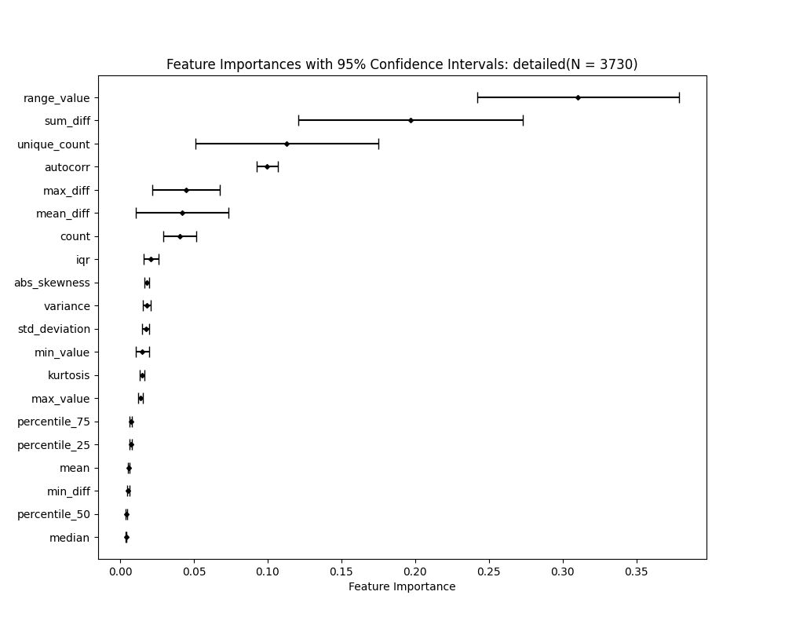
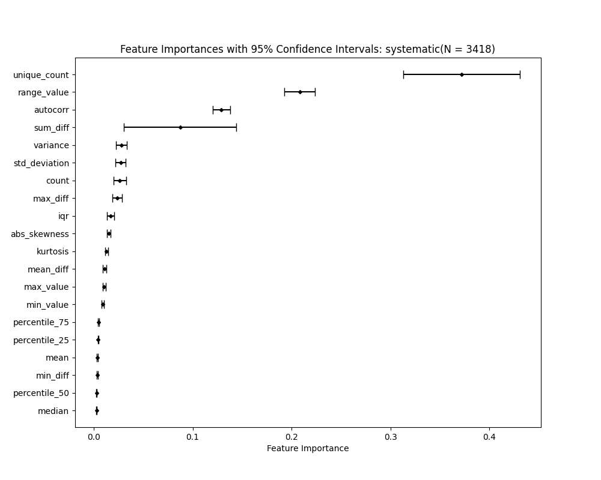
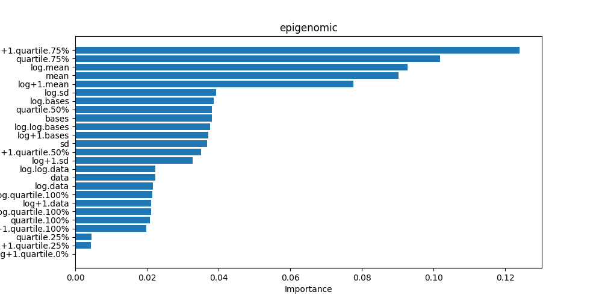

# ChangepointDetection FeatureImportance
## Random Forest
 - Feature Importance:
   - Each decision tree in the forest splits nodes based on a certain feature to reduce a chosen impurity criterion (e.g., MSE for regression).
   - For each tree, scikit-learn computes the total reduction in impurity (the improvement in the prediction error) each time a feature is used to split a node.
   - For each feature, the total reduction in impurity across all nodes in all trees that the feature was used to split is calculated.
   - The feature importance scores are then normalized, so they sum up to 1. This is done by dividing each feature’s importance by the sum of all features’ importances.
   - The idea is that a feature that reduces the impurity the most is considered more important.

