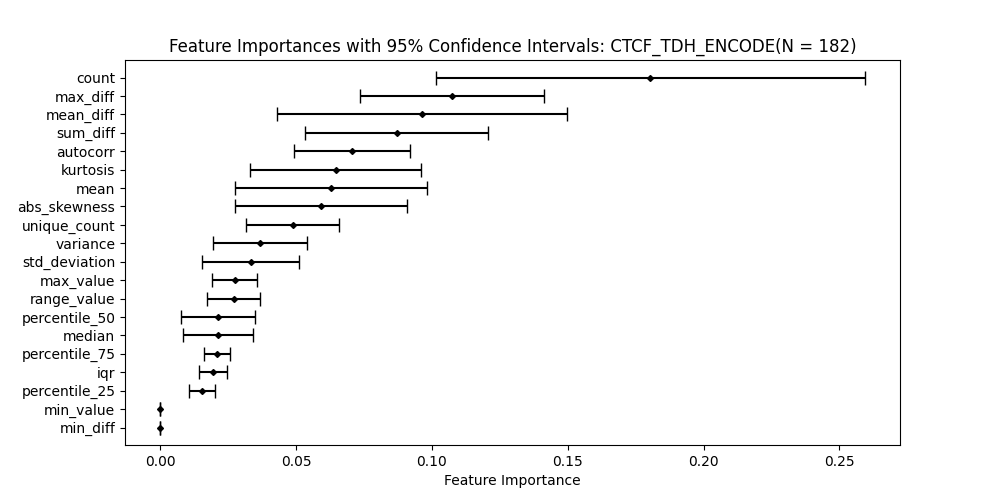
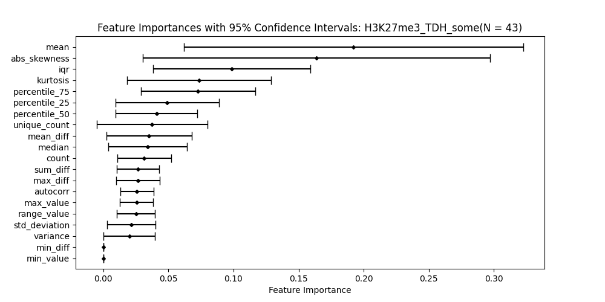

# ChangepointDetection FeatureImportance
## Random Forest Regression
The dataset $(X, y_{\text{low}}, y_{\text{up}})$ is split into two subsets: $(X, y_{\text{low}})$ and $(X, y_{\text{up}})$. Before training, all rows containing infinity values in either $y_{\text{low}}$ or $y_{\text{up}}$ are removed.

We then proceed as follows:
1. Train separate Random Forest models for $(X, y_{\text{low}})$ and $(X, y_{\text{up}})$.
2. Compute feature importance for both models.
3. Calculate the final feature importance by averaging the importances from the Random Forest models for $y_{\text{low}}$ and $y_{\text{up}}$.

## Random Forest Classification
The dataset `(X, y_low, y_up)` is divided into two classes: `(X, y_low)` and `(X, y_up)`. Prior to training, any rows that contain infinity values in either `y_low` or `y_up` are removed.

The following steps are taken:
1. Train Random Forest classifiers separately on `(X, y_low)` and `(X, y_up)`.
2. Disregard the feature importance from `y_low` and `y_up` since they are not technically features in interval regression.

